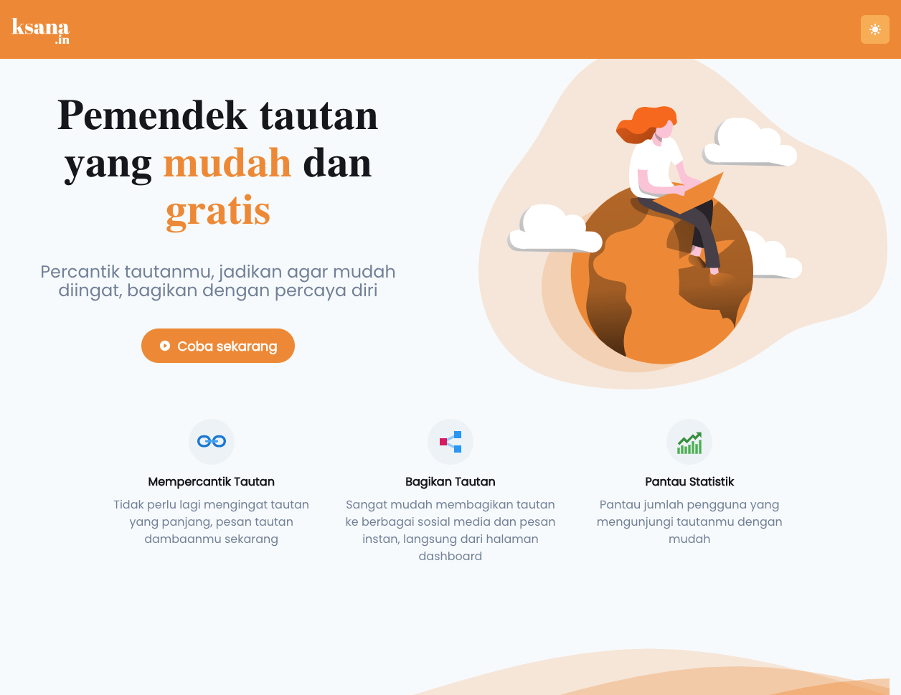

# [ksana.in](https://ksana.in)

Pemendek tautan yang mudah dan gratis

## Screenshots

|               Desktop               |              Mobile               |
| :---------------------------------: | :-------------------------------: |
|  |  |

## Credits

- [Next.js](https://nextjs.org/)
- [Supabase](https://supabase.io/)
- [Chakra-UI](https://chakra-ui.com/docs/getting-started)
- [SWR](https://swr.vercel.app/)
- [React-Icons](https://react-icons.github.io/react-icons/)
- [Oge](https://oge.vercel.app/)
- Illustrations by [manypixels.co](https://www.manypixels.co/gallery)

---

Copyright ©️ 2021 by Irfan Maulana
