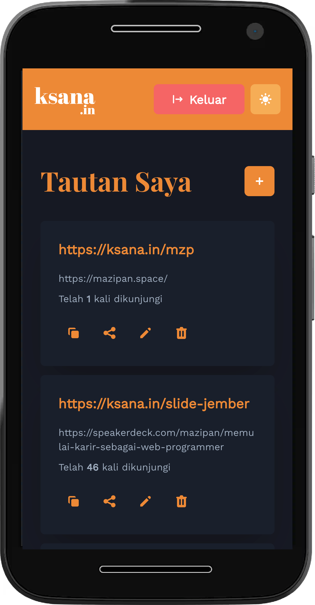

# [ksana.in](https://ksana.in)


✂️ Layanan pemendek tautan yang mudah, gratis & tanpa iklan

## Features

- Built for Mobile Device (PWA support)
- Full authentication flow:
  - Login (with Email and Google)
  - Register (with Email and Google)
  - Forget Password
- Simple hit stats
- Share link using Native Share (for mobile web)
- Copy link using Clipboard API (for supported browser)

## Screenshots

<table>
 <tbody>
   <tr>
     <td>
       
     </td>
     <td>
        
     </td>
     <td>
        
     </td>
   </tr>
 </tbody>
</table>

## Installation

Copy file `.env.local.example` to `.env.local` and change value with your own supabase url and anonymous key.
You can get it after register and create your own project on Supabase.io.

```
NEXT_PUBLIC_SUPABASE_URL=https://your-project.supabase.co
NEXT_PUBLIC_SUPABASE_ANON_KEY=your-anon-key
```

## Create table `urls` on Supabase

Go to the SQL tab and execute this query on the editor.

```sql
create table urls (
  id bigint generated by default as identity primary key,
  user_id uuid references auth.users not null,
  real_url text check (char_length(real_url) > 1),
  slug text check (char_length(slug) > 1),
  hit integer default 0,
  inserted_at timestamp with time zone default timezone('utc'::text, now()) not null,
  updated_at timestamp with time zone default timezone('utc'::text, now()) not null
);
```

Add triggers for "updated_at" field

```sql
create extension if not exists moddatetime schema extensions;

-- this trigger will set the "updated_at" column to the current timestamp for every update
create trigger handle_updated_at before update on urls 
  for each row execute procedure moddatetime (updated_at);
```

## Additional settings for Authentication

- on Authentication setting, change `Site URL` to `/callback`. e.g: `https://ksana.in/callback`, for development just set it to `http://localhost:3000/callback`
- To support Google Login, in Authentication setting page, set the `Google Client ID` and `Google Secret`

## Add environment variables on Vercel

You can found all required environment variables on `.env.local.example`

## Can I deploy to my own domain?

The code is open for learning purpose.
But in case you didn't like the default domain (`ksana.in`), feel free to deploy to your own domain.
Since Ksana.in is using a free plan from Supabase, it have many limitation in term of size.
If you plan to use it in the bigger frequency, I suggest to deploy it with your own Supabase plan.

## Credits

- [Next.js](https://nextjs.org/)
- [Supabase](https://supabase.io/)
- [Chakra-UI](https://chakra-ui.com/docs/getting-started)
- [SWR](https://swr.vercel.app/)
- [React-Icons](https://react-icons.github.io/react-icons/)
- [Oge](https://oge.vercel.app/)
- Illustrations by [manypixels.co](https://www.manypixels.co/gallery)

## Support me

- 👉 🇮🇩 [Trakteer](https://trakteer.id/mazipan/tip?utm_source=github)
- 👉 🌍 [BuyMeACoffe](https://www.buymeacoffee.com/mazipan?utm_source=github)
- 👉 🌍 [Paypal](https://www.paypal.me/mazipan?utm_source=github)
- 👉 🌍 [Ko-Fi](https://ko-fi.com/mazipan)

---

Copyright ©️ 2021 by Irfan Maulana
